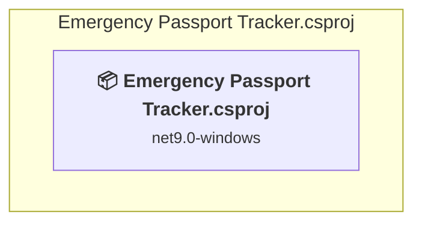

# Projects and dependencies analysis

This document provides a comprehensive overview of the projects and their dependencies in the context of upgrading to .NETCoreApp,Version=v10.0.

## Table of Contents

- [Executive Summary](#executive-Summary)
  - [Highlevel Metrics](#highlevel-metrics)
  - [Projects Compatibility](#projects-compatibility)
  - [Package Compatibility](#package-compatibility)
  - [API Compatibility](#api-compatibility)
  - [Binding Redirect Configuration](#binding-redirect-configuration)
- [Aggregate NuGet packages details](#aggregate-nuget-packages-details)
- [Top API Migration Challenges](#top-api-migration-challenges)
  - [Technologies and Features](#technologies-and-features)
  - [Most Frequent API Issues](#most-frequent-api-issues)
- [Projects Relationship Graph](#projects-relationship-graph)
- [Project Details](#project-details)

  - [Emergency Passport Tracker.csproj](#emergency-passport-trackercsproj)

## Executive Summary

### Highlevel Metrics

| Metric | Count | Status |
| :--- | :---: | :--- |
| Total Projects | 1 | All require upgrade |
| Total NuGet Packages | 1 | All packages need upgrade |
| Total Code Files | 11 |  |
| Total Code Files with Incidents | 7 |  |
| Total Lines of Code | 2435 |  |
| Total Number of Issues | 1527 |  |
| Estimated LOC to modify | 1525+ | at least 62.6% of codebase |

### Projects Compatibility

| Project | Target Framework | Difficulty | Package Issues | API Issues | Binding Issues | Est. LOC Impact | Description |
| :--- | :---: | :---: | :---: | :---: | :---: | :---: | :--- |
| [Emergency Passport Tracker.csproj](#emergency-passport-trackercsproj) | net9.0-windows | 🟡 Medium | 1 | 1525 | 0 | 1525+ | WinForms, Sdk Style = True |

### Package Compatibility

| Status | Count | Percentage |
| :--- | :---: | :---: |
| ✅ Compatible | 0 | 0.0% |
| ⚠️ Incompatible | 1 | 100.0% |
| 🔄 Upgrade Recommended | 0 | 0.0% |
| ***Total NuGet Packages*** | ***1*** | ***100%*** |

### API Compatibility

| Category | Count | Impact |
| :--- | :---: | :--- |
| 🔴 Binary Incompatible | 1411 | High - Require code changes |
| 🟡 Source Incompatible | 114 | Medium - Needs re-compilation and potential conflicting API error fixing |
| 🔵 Behavioral change | 0 | Low - Behavioral changes that may require testing at runtime |
| ✅ Compatible | 2269 |  |
| ***Total APIs Analyzed*** | ***3794*** |  |

## Aggregate NuGet packages details

| Package | Current Version | Suggested Version | Projects | Description |
| :--- | :---: | :---: | :--- | :--- |
| itext7 | 9.5.0 |  | [Emergency Passport Tracker.csproj](#emergency-passport-trackercsproj) | ⚠️NuGet package is deprecated |

## Top API Migration Challenges

### Technologies and Features

| Technology | Issues | Percentage | Migration Path |
| :--- | :---: | :---: | :--- |
| Windows Forms | 1411 | 92.5% | Windows Forms APIs for building Windows desktop applications with traditional Forms-based UI that are available in .NET on Windows. Enable Windows Desktop support: Option 1 (Recommended): Target net9.0-windows; Option 2: Add <UseWindowsDesktop>true</UseWindowsDesktop>; Option 3 (Legacy): Use Microsoft.NET.Sdk.WindowsDesktop SDK. |
| Windows Forms Legacy Controls | 221 | 14.5% | Legacy Windows Forms controls that have been removed from .NET Core/5+ including StatusBar, DataGrid, ContextMenu, MainMenu, MenuItem, and ToolBar. These controls were replaced by more modern alternatives. Use ToolStrip, MenuStrip, ContextMenuStrip, and DataGridView instead. |
| GDI+ / System.Drawing | 104 | 6.8% | System.Drawing APIs for 2D graphics, imaging, and printing that are available via NuGet package System.Drawing.Common. Note: Not recommended for server scenarios due to Windows dependencies; consider cross-platform alternatives like SkiaSharp or ImageSharp for new code. |
| Legacy Configuration System | 2 | 0.1% | Legacy XML-based configuration system (app.config/web.config) that has been replaced by a more flexible configuration model in .NET Core. The old system was rigid and XML-based. Migrate to Microsoft.Extensions.Configuration with JSON/environment variables; use System.Configuration.ConfigurationManager NuGet package as interim bridge if needed. |

### Most Frequent API Issues

| API | Count | Percentage | Category |
| :--- | :---: | :---: | :--- |
| T:System.Windows.Forms.Button | 96 | 6.3% | Binary Incompatible |
| T:System.Windows.Forms.DialogResult | 94 | 6.2% | Binary Incompatible |
| T:System.Windows.Forms.MessageBoxIcon | 76 | 5.0% | Binary Incompatible |
| T:System.Windows.Forms.MessageBoxButtons | 76 | 5.0% | Binary Incompatible |
| T:System.Windows.Forms.TextBox | 72 | 4.7% | Binary Incompatible |
| T:System.Windows.Forms.AnchorStyles | 44 | 2.9% | Binary Incompatible |
| T:System.Windows.Forms.MessageBox | 38 | 2.5% | Binary Incompatible |
| T:System.Windows.Forms.DataGridView | 38 | 2.5% | Binary Incompatible |
| T:System.Windows.Forms.Label | 37 | 2.4% | Binary Incompatible |
| F:System.Windows.Forms.MessageBoxButtons.OK | 33 | 2.2% | Binary Incompatible |
| M:System.Windows.Forms.MessageBox.Show(System.Windows.Forms.IWin32Window,System.String,System.String,System.Windows.Forms.MessageBoxButtons,System.Windows.Forms.MessageBoxIcon) | 33 | 2.2% | Binary Incompatible |
| T:System.Windows.Forms.Control.ControlCollection | 29 | 1.9% | Binary Incompatible |
| P:System.Windows.Forms.Control.Controls | 29 | 1.9% | Binary Incompatible |
| M:System.Windows.Forms.Control.ControlCollection.Add(System.Windows.Forms.Control) | 29 | 1.9% | Binary Incompatible |
| P:System.Windows.Forms.Control.Location | 28 | 1.8% | Binary Incompatible |
| P:System.Windows.Forms.Control.Size | 26 | 1.7% | Binary Incompatible |
| P:System.Windows.Forms.Control.TabIndex | 23 | 1.5% | Binary Incompatible |
| P:System.Windows.Forms.Control.Name | 17 | 1.1% | Binary Incompatible |
| T:System.Drawing.Brushes | 15 | 1.0% | Source Incompatible |
| T:System.Drawing.Brush | 15 | 1.0% | Source Incompatible |
| P:System.Drawing.Brushes.Black | 15 | 1.0% | Source Incompatible |
| M:System.Drawing.Graphics.DrawString(System.String,System.Drawing.Font,System.Drawing.Brush,System.Single,System.Single) | 15 | 1.0% | Source Incompatible |
| T:System.Windows.Forms.PictureBox | 14 | 0.9% | Binary Incompatible |
| F:System.Windows.Forms.MessageBoxIcon.Information | 13 | 0.9% | Binary Incompatible |
| T:System.Windows.Forms.FormStartPosition | 12 | 0.8% | Binary Incompatible |
| P:System.Windows.Forms.ButtonBase.Text | 12 | 0.8% | Binary Incompatible |
| M:System.Windows.Forms.Button.#ctor | 12 | 0.8% | Binary Incompatible |
| F:System.Windows.Forms.MessageBoxIcon.Warning | 11 | 0.7% | Binary Incompatible |
| F:System.Windows.Forms.MessageBoxIcon.Error | 11 | 0.7% | Binary Incompatible |
| P:System.Windows.Forms.TextBox.Text | 10 | 0.7% | Binary Incompatible |
| E:System.Windows.Forms.Control.Click | 10 | 0.7% | Binary Incompatible |
| F:System.Windows.Forms.DialogResult.OK | 8 | 0.5% | Binary Incompatible |
| P:System.Windows.Forms.Control.Bottom | 8 | 0.5% | Binary Incompatible |
| M:System.Windows.Forms.TextBox.#ctor | 8 | 0.5% | Binary Incompatible |
| P:System.Windows.Forms.DataGridViewColumn.HeaderText | 8 | 0.5% | Binary Incompatible |
| T:System.Windows.Forms.DataGridViewComboBoxColumn | 8 | 0.5% | Binary Incompatible |
| P:System.Windows.Forms.Control.Anchor | 8 | 0.5% | Binary Incompatible |
| P:System.Windows.Forms.ButtonBase.UseVisualStyleBackColor | 8 | 0.5% | Binary Incompatible |
| P:System.Windows.Forms.Label.Text | 7 | 0.5% | Binary Incompatible |
| P:System.Windows.Forms.Label.AutoSize | 7 | 0.5% | Binary Incompatible |
| M:System.Windows.Forms.Label.#ctor | 7 | 0.5% | Binary Incompatible |
| T:System.Drawing.Font | 7 | 0.5% | Source Incompatible |
| P:System.Windows.Forms.FileDialog.FileName | 7 | 0.5% | Binary Incompatible |
| P:System.Windows.Forms.DataGridViewColumn.Name | 7 | 0.5% | Binary Incompatible |
| T:System.Windows.Forms.FormBorderStyle | 6 | 0.4% | Binary Incompatible |
| M:System.Windows.Forms.TextBoxBase.Clear | 6 | 0.4% | Binary Incompatible |
| T:System.Drawing.FontStyle | 6 | 0.4% | Source Incompatible |
| T:System.Windows.Forms.Keys | 6 | 0.4% | Binary Incompatible |
| T:System.Windows.Forms.DataGridViewRowCollection | 6 | 0.4% | Binary Incompatible |
| P:System.Windows.Forms.DataGridView.Rows | 6 | 0.4% | Binary Incompatible |

## Projects Relationship Graph

Legend:
📦 SDK-style project
⚙️ Classic project

## Project Details

### Emergency Passport Tracker.csproj

#### Project Info

- **Current Target Framework:** net9.0-windows
- **Proposed Target Framework:** net10.0-windows
- **SDK-style**: True
- **Project Kind:** WinForms
- **Dependencies**: 0
- **Dependants**: 0
- **Number of Files**: 13
- **Number of Files with Incidents**: 7
- **Lines of Code**: 2435
- **Estimated LOC to modify**: 1525+ (at least 62.6% of the project)

#### Dependency Graph

Legend:
📦 SDK-style project
⚙️ Classic project

### API Compatibility

| Category | Count | Impact |
| :--- | :---: | :--- |
| 🔴 Binary Incompatible | 1411 | High - Require code changes |
| 🟡 Source Incompatible | 114 | Medium - Needs re-compilation and potential conflicting API error fixing |
| 🔵 Behavioral change | 0 | Low - Behavioral changes that may require testing at runtime |
| ✅ Compatible | 2269 |  |
| ***Total APIs Analyzed*** | ***3794*** |  |

#### Project Technologies and Features

| Technology | Issues | Percentage | Migration Path |
| :--- | :---: | :---: | :--- |
| Legacy Configuration System | 2 | 0.1% | Legacy XML-based configuration system (app.config/web.config) that has been replaced by a more flexible configuration model in .NET Core. The old system was rigid and XML-based. Migrate to Microsoft.Extensions.Configuration with JSON/environment variables; use System.Configuration.ConfigurationManager NuGet package as interim bridge if needed. |
| GDI+ / System.Drawing | 104 | 6.8% | System.Drawing APIs for 2D graphics, imaging, and printing that are available via NuGet package System.Drawing.Common. Note: Not recommended for server scenarios due to Windows dependencies; consider cross-platform alternatives like SkiaSharp or ImageSharp for new code. |
| Windows Forms Legacy Controls | 221 | 14.5% | Legacy Windows Forms controls that have been removed from .NET Core/5+ including StatusBar, DataGrid, ContextMenu, MainMenu, MenuItem, and ToolBar. These controls were replaced by more modern alternatives. Use ToolStrip, MenuStrip, ContextMenuStrip, and DataGridView instead. |
| Windows Forms | 1411 | 92.5% | Windows Forms APIs for building Windows desktop applications with traditional Forms-based UI that are available in .NET on Windows. Enable Windows Desktop support: Option 1 (Recommended): Target net9.0-windows; Option 2: Add <UseWindowsDesktop>true</UseWindowsDesktop>; Option 3 (Legacy): Use Microsoft.NET.Sdk.WindowsDesktop SDK. |

